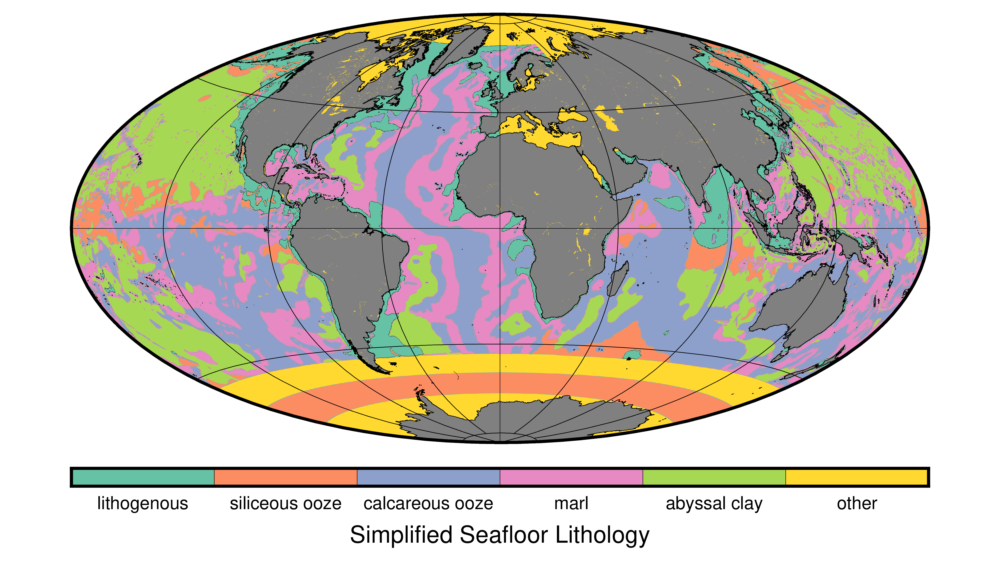
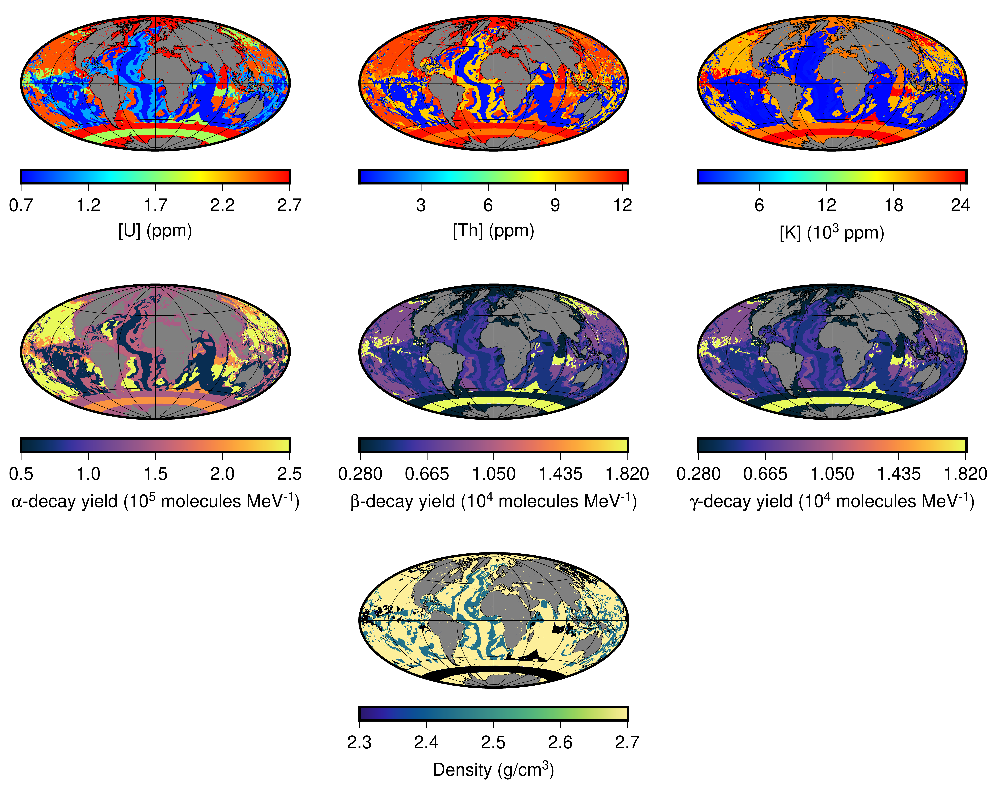
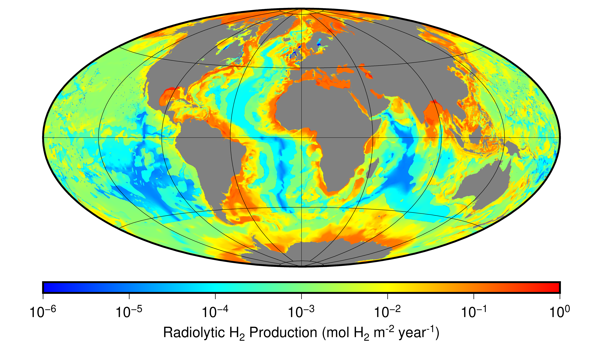
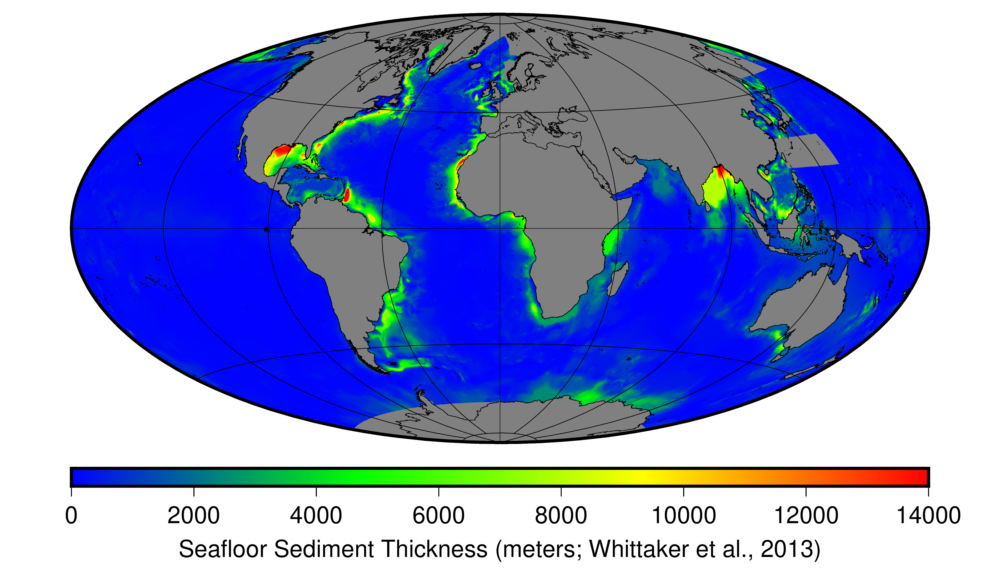
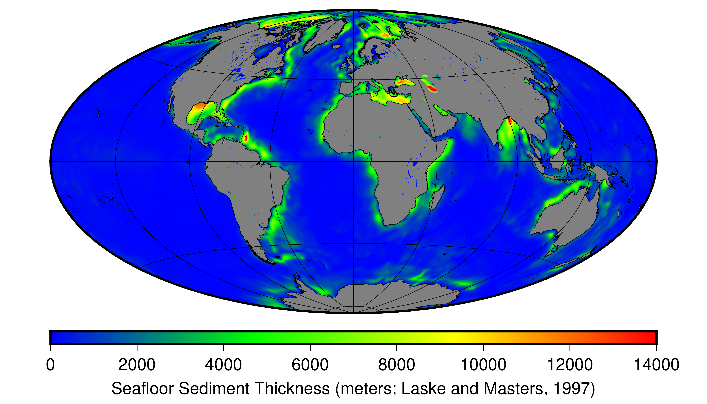
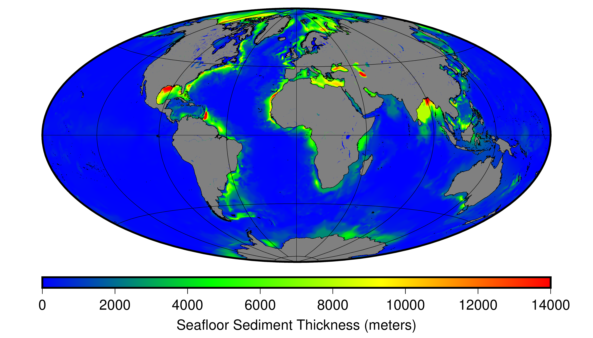
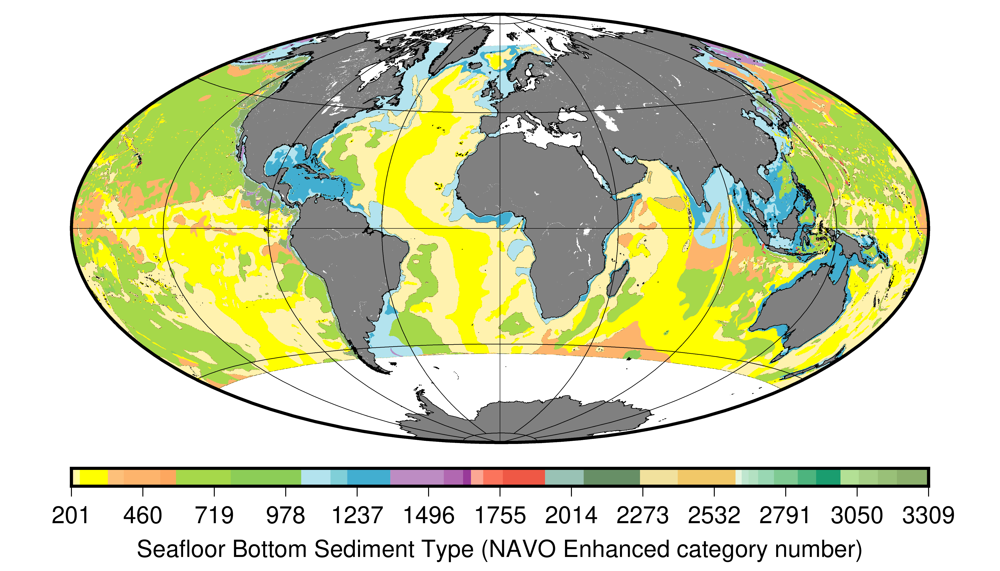

# Global estimate of seafloor sediment radiolytic H2 production   

Sauvage, J. F., Flinders, A. F., Spivack, A. J., Pockalny, R., Dunlea, A. G., Anderson, C. H., Smith, D. C., Murray, R. W., and D’Hondt, S. <b>The contribution of water radiolysis to marine sedimentary life</b>, <i>Nature</i> (submitted) (2020).
   

***  

## Summary   
Water radiolysis continuously produces H2 and oxidized chemicals in wet sediment and rock1,[2](https://www.liebertpub.com/doi/10.1089/ast.2007.0150),[3](https://link.springer.com/article/10.1007/s002489901002),[4](https://www.liebertpub.com/doi/abs/10.1089/ast.2014.1255). Radiolytic H2 has been identified as the primary electron donor (food) for microorganisms in continental aquifers kilometers below Earth’s surface[5](https://agupubs.onlinelibrary.wiley.com/doi/10.1029/2004GC000907),[6](https://www.nature.com/articles/nature14017). Radiolytic products may also be significant for sustaining life in subseafloor sediment[7](https://www.nature.com/articles/ngeo2387) and subsurface environments of other planets[8](https://www.nature.com/articles/ngeo2387),[9](https://www.sciencedirect.com/science/article/abs/pii/S0012821X1000049X). However, the extent to which most subsurface ecosystems rely on radiolytic products has been poorly constrained, due to incomplete understanding of radiolytic chemical yields in natural environments. Here we show that the global rate of radiolytic H2 production in marine sediment appears to be 2-3% of the global organic flux to the seafloor. Comparison of radiolytic H2 consumption rates to organic oxidation rates suggests that water radiolysis is the principal source of biologically accessible energy for microbial communities in marine sediment older than a few million years. Where water permeates similarly catalytic material on other worlds, life may also be sustainable by water radiolysis.   

In *Sauvage et al.* (2020) we estimate global radiolytic H2 production in marine sediment (`global_H2.py`) using the H2 production rate equation of [*Blair et al.* (2007)](https://www.liebertpub.com/doi/10.1089/ast.2007.0150) (`radiolysis_model.py`). Our estimate spatially integrates this calculation of sedimentary porewater radiolysis rate using (i) our experimentally constrained radiolytic H2 yields (&#945;, &#946;, &#947;) for five principal seafloor sediment types, (ii) measured radioactive element contents (uranium, thorium, potassium) of sediment cores in three ocean basins (North Atlantic[9](http://whp-atlas.ucsd.edu/atlantic_index.htm), North Pacific[10](https://www.whoi.edu/cruiseplanning/synopsis.do?id=2802), and South Pacific[11](http://publications.iodp.org/proceedings/329/329.PDF),[2](https://www.liebertpub.com/doi/10.1089/ast.2007.0150); `sediment_parameters.py`), and (iii) global distributions of seafloor sediment type[12](https://www.oc.nps.edu/~bird/oc2930/sediments/Bottom_Sediment_Type_dbdd_navo.doc)(`BST_categories.py`), sediment porosity[13](https://agupubs.onlinelibrary.wiley.com/doi/full/10.1002/2015GL065279), and sediment thickness[14](https://www.ngdc.noaa.gov/mgg/sedthick/#version2),[15](https://igppweb.ucsd.edu/~gabi/sediment.html).   

   

The geographic database of global bottom sediment types[21](https://www.oc.nps.edu/~bird/oc2930/sediments/Bottom_Sediment_Type_dbdd_navo.doc) was subdivided into six lithologic categories: lithogenous, siliceous ooze, calcareous ooze, marl, abyssal clay, and “other” (`BST_categories.py`). The “other” category includes all areas of the seafloor that were not described in the database, including (i) high-latitude regions and (ii) some discrete areas located along the continental margins (e.g. Mediterranean Sea, Red Sea, Hudson Bay, etc.). To complete the database for high latitudes, we added an opal belt (siliceous ooze) in the Southern Ocean between 57°S and 66°S[25](https://pubs.geoscienceworld.org/gsa/geology/article/43/9/795/131939),[26](https://www.sciencedirect.com/science/article/abs/pii/S0967064502000760). We defined the areas of the seafloor from 50°S to 57°S, from 66°S to 90°S, and in the Arctic Ocean as mostly composed of lithogenous material.    

Using this simplified lithology dataset we created global datasets of radiolytic H2 yields (&#945;, &#946;, &#947;), radioactive element contents (uranium, thorium, potassium), and sediment density (`sediment_parameters.py`).   

  

For each geographic location we then used these global datasets to calculate the site-specific radiolytic H2 production rate[2](https://www.liebertpub.com/doi/10.1089/ast.2007.0150) (`radiolysis_model.py`). As radiolytic H2 production rate is porosity dependent, which in turn is dependent on depth in the sediment column, we performed this calculation over 1-meter depth bins then summed over the total sediment column (or until the porosity < 0.1%).   

  

This dataset is saved in `input/H2_PRODUCTION.grd` in units of mol H2 m-2 year-1.   

Lastly, to calculate a global annual production rate of radiolytic H2 in marine sediment we projected our geographic dataset into a supersampled Lambert Azimuthal Equal Area Projection, summed over all gridcells, multiplied by the constant gridcell area, and then doubled (i.e. two mol electron equivalents per mol of H2);

**Global Annual Production Rate of Radiolytic H2:**  2.68 x 1013 mol electron equivalents per year   

More information can be found in the **Methods** and **Supplemental** sections of *Sauvage et al.* (2020).   

***
## Package Description
**Python (3.6) Dependencies**   
numpy, pyproj, scipy, netCDF4   

`global_H2.py` global estimator of radiolytic H2 production in marine sediment   

`BST_categories.py` subdivision of global bottom sediment type codes into five lithologic categories   

`radiolysis_model.py` H2 production rate equation of [*Blair et al.* (2007)](https://www.liebertpub.com/doi/10.1089/ast.2007.0150)   

`sediment_parameters.py` radiolytic H2 yields (&#945;, &#946;, &#947;) and radioactive element contents (uranium, thorium, potassium)

`netcdf_api.py` netcdf IO   

To reproduce the results only `global_H2.py` needs to be run directly. The parameter `zstep` controls the fineness of the depth binning. Typical run times for `zstep = 10` (i.e. 10 meter depth binning) are 1-2 hours, while `zstep = 1` (i.e. 1 meter) can take several days to complete. Running at 10 meter depth binning results in a negligible 0.8% underestimate compared to 1 meter binning. 

***
## Preprocessing   
The global estimates of radiolytic hydrogen production depend on five publicly-available datasets which define: ocean depth (GEBCO, 2014),  seafloor sediment porosity (Martin et al., 2015), seafloor sediment thickness (Whittaker et al., 2013; Laske and Masters, 1997), and seafloor bottom sediment type (NAVO, 2003). These datasets need to be preprocessed prior to running the code hosted here.  

Preprocessing involves converting all datasets to a common global reference frame with the same 5 arc minute grid spacing. Masks filtering out land data are applied when appropriate. Preprocessing is done using Generic Mapping Tools (GMT) v. 6.0, in a bash shell. Due to the possibly complicated system dependencies of GMT, the preprocessing code is explicitly given here, and not as a standalone executable script. However, if GMT v. 6.0 is correctly setup, you should be able to paste the code as presented directly into a bash script (`#!/bin/bash`).  

The final preprocessed grids are included in this package under the folder `INPUT` and the following preprocess workflow is provided for completeness and transparency but is not necessary to run the package.  

#
### Ocean Depth  

*reference*: [General Bathymetric Chart of the Oceans (GEBCO) Compilation Group (2014) GEBCO 2014 Grid.](https://www.gebco.net/data_and_products/historical_data_sets/#gebco_2014)  
*dataset*:  [GEBCO_2014_2D.nc](https://www.bodc.ac.uk/data/open_download/gebco/GEBCO_30SEC/zip/)  

Preprocessing:  
input dataset: `GEBCO_2014_2D.nc`  
output dataset: `bathymetry.grd`  
output units: meters

\# create a land mask  
`gmt grdlandmask -RGEBCO_2014_2D.nc -Gtmp1.grd -Df -N1/NaN`  

\# mask land features  
`gmt grdmath GEBCO_2014_2D.nc tmp1.grd MUL = tmp2.grd`  

\# downsample to 5 arc minutes (NAVO BST dataset spacing)  
`gmt grdsample tmp2.grd -Gtmp3.grd -R-180/180/-90/90 -I5m`  

\# set everything above sealevel to NaN  
`gmt grdclip -Sa0/NaN tmp3.grd -Gtmp4.grd`  

\# change to positive depths  
`gmt grdmath tmp4.grd -1 MUL = depth.grd`   

   

#
### Seafloor Sediment Porosity

*reference*: [Martin, K. M., Wood, W. T., & Becker, J. J. A global prediction of seafloor sediment porosity using machine learning. _Geophysical Research Letters_ **42** (2015).]( https://agupubs.onlinelibrary.wiley.com/doi/full/10.1002/2015GL065279)   
*dataset*: [grl53425-sup-0002-supinfo.grd](https://agupubs.onlinelibrary.wiley.com/action/downloadSupplement?doi=10.1002%2F2015GL065279&file=grl53425-sup-0002-supinfo.grd)  

Preprocessing:  
input dataset: `grl53425-sup-0002-supinfo.grd`  
output dataset: `porosity.grd`  
output units: percent, i.e. 0-to-100%

\# convert from pixel-node to gridline-node registration  
`gmt grdsample -R-180/180/-90/90 -I5m grl53425-sup-0002-supinfo.grd -Gporosity.grd -T`  

   

#
### Seafloor Sediment Thickness   

*Sediment thickness is from Whittaker et al. (2013), supplemented with Laske and Masters (1997) where needed. We preprocess both datasets and join them into a single sediment thickness dataset.*  

**Whittaker et al. (2013)**  
*reference*: [Whittaker, J., Goncharov, A., Williams, S. R., Müller, D.,  Leitchenkov, G. Global sediment thickness dataset updated for the Australian-Antarctic Southern Ocean. _Geochemistry, Geophysics, Geosystems_ (2013).](https://www.ngdc.noaa.gov/mgg/sedthick/#version2)  
*dataset*:  [sedthick_world_v2.grd](https://www.ngdc.noaa.gov/mgg/sedthick/data/version3/GlobSed.zip)  

Preprocessing:  
input dataset: `sedthick_world_v2.grd`  
output dataset: `whittaker_sedthick.grd` 

\# convert longitude from 0-to-360 to -180-to-180  
`gmt grdedit sedthick_world_v2.grd -S -R-180/180/-70/80 -Gtmp1.grd`  

\# dump as xyz so we can regrid over global bounds  
`gmt grd2xyz tmp1.grd > tmp2.xyz`  

\# regrid to global latitude (original was -70-to-80)  
`gmt xyz2grd tmp2.xyz -R-180/180/-90/90 -I5m -Gwhittaker_sedthick.grd`  

   

**Laske and Masters (1997)**  
*reference*: [Laske G. and G. Masters. A Global Digital Map of Sediment Thickness, _EOS Trans. AGU_ **78**, F483 (1997).](https://igppweb.ucsd.edu/~gabi/sediment.html)  
*dataset*:  [sedmap.grd](https://igppweb.ucsd.edu/~gabi/sediment.html#ftp)  

Preprocessing:  
input dataset: `sedmap.grd`  
output dataset: `laske_sedthick.grd` 

\# upsample to 5 arc minutes (NAVO BST dataset spacing)  
`gmt grdsample -R0/360/-90/90 -I5m sedmap.grd -Gtmp1.grd`  

\# convert longitude from 0-to-360 to -180-to-180  
`gmt grdedit tmp1.grd -S -R-180/180/-90/90 -Gtmp2.grd`  

\# create a land mask  
`gmt grdlandmask -Rtmp2.grd -Df -N1/NaN -Gtmp3.grd`  

\# mask land features  
`gmt grdmath tmp2.grd tmp3.grd MUL = tmp4.grd`  

\# convert from kilometers to meters  
`gmt grdmath tmp4.grd 1000 MUL = tmp5.grd`  

\# set everything below 0 thickness to 0   
`gmt grdclip -Sb0/0 tmp5.grd -Glaske_sedthick.grd`   

   

**Composite Dataset**  
output dataset: sediment_thickness.grd  
output units: meters

\# replace all NaNs in Whittaker et al. (2013) with values from Laske and Masters (1997)  
`gmt grdmath whittaker_sedthick.grd laske_sedthick.grd DENAN = tmp1.grd`  

\# if there are any values with negative thickness, set them equal to zero  
`gmt grdclip -Sb0/0 tmp1.grd -Gsediment_thicnkess.grd`  

   

#
### Seafloor Bottom Sediment Type (BST)

*reference*: [Naval Oceanographic Office. Database description for bottom sediment type. OAML-DBD-86, Stennis Space Center, Mississsippi: Acoustics Division (2003).](https://www.oc.nps.edu/~bird/oc2930/sediments/Bottom_Sediment_Type_dbdd_navo.doc)  
*dataset*: NAVO_Enhanced_BST.dat\*  

\* *extracted separately from the unclassified BST database "Enhanced" dataset and included here as an xyz*

Preprocessing:  
input dataset: `NAVO_Enhanced_BST.dat`  
output dataset: `sediment_type.grd`  
output units: lithology code (*see reference*)

\# create global grid at native 5 arc minute resolution  
`gmt xyz2grd -R-180/180/-90/90 -I5m NAVO_Enhanced_BST.dat -h1 -Gtmp1.grd`  

\# set NaNs to 9999  
`gmt grdmath tmp1.grd 9999 DENAN = tmp2.grd`  

\# create a land mask  
`gmt grdlandmask -Rtmp2.grd -Df -N1/NaN -Gtmp3.grd`  

\# mask land features    
`gmt grdmath tmp2.grd tmp3.grd MUL = sediment_type.grd`  

   

***
## References   
**1.**   J. W. T. Spinks, R. J. W. *An Introduction to Radiation Chemistry*. 3rd edn,  (Wiley-Interscience, 1990).   

**2.**	Blair, C. C., D'Hondt, S., Spivack, A. J. & Kingsley, R. H. Radiolytic hydrogen and microbial respiration in subsurface sediments. *Astrobiology* **7**, 951-970 (2007).   

**3.**	Morita, R. Is H 2 the universal energy source for long-term survival? *Microbial ecology* **38**, 307-320 (1999).   

**4.**	Türke, A., Nakamura, K. & Bach, W. Palagonitization of basalt glass in the flanks of mid-ocean ridges: implications for the bioenergetics of oceanic intracrustal ecosystems. *Astrobiology* **15**, 793-803 (2015).   

**5.**	Lin, L. H. *et al.* Radiolytic H2 in continental crust: nuclear power for deep subsurface microbial communities. *Geochemistry, Geophysics, Geosystems* **6** (2005).   

**6.**	Lollar, B. S., Onstott, T. C., Lacrampe-Couloume, G. & Ballentine, C. The contribution of the Precambrian continental lithosphere to global H2 production. *Nature* **516**, 379 (2014).   

**7.**	D’Hondt, S. *et al.* Presence of oxygen and aerobic communities from sea floor to basement in deep-sea sediments. *Nature Geoscience* **8**, 299 (2015).   

**8.**	Lefticariu, L., Pratt, L. A., LaVerne, J. A. & Schimmelmann, A. Anoxic pyrite oxidation by water radiolysis products—A potential source of biosustaining energy. *Earth and Planetary Science Letters* **292**, 57-67 (2010).   

**9.**	Koltermann, K. P., Gouretski, V. V., Jancke, K. Hydrographic Atlas of the World Ocean Circulation Experiment (WOCE). Volume 3: Atlantic Ocean (eds. M. Sparrow, P. Chapman and J. Gould). International WOCE Project Office, Southampton, UK, 2011).   

**10.**	Murray and R/V Knorr Cruise KN223 scientists, Cruise Report (2014).   

**11.**	D’Hondt, S., Inagaki, F., Zarikian, C. A. and the Expedition 329 Scientists, *Proceedings of the Integrated Ocean Drilling Program* **329** (2011).   

**12.**	Naval Oceanographic Office. Database description for bottom sediment type. OAML-DBD-86, Stennis Space Center, Mississsippi: Acoustics Division (2003).   

**13.**	Martin, K. M., Wood, W. T., & Becker, J. J. A global prediction of seafloor sediment porosity using machine learning. *Geophysical Research Letters* **42** (2015).   

**14.**	Divins, D. L., Total Sediment Thickness of the World's Oceans & Marginal Seas, NOAA National Geophysical Data Center, Boulder, CO, (2003).   

**15.**	Masters, G., Laske, G. On bias in surface wave and free oscillation attenuation measurements. *EOS Trans.*-Am. Geophys. Union **78**, F485 (1997).   
